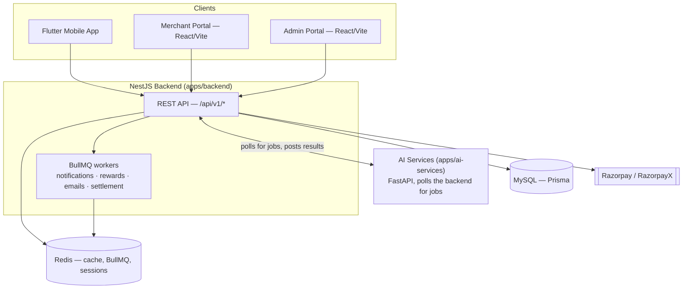

# Architecture

This describes the system as it actually exists in this codebase today — not the
aspirational platform sketched in `Review Hub.txt`. Where the two disagree, this
document wins; treat that file as historical product-vision notes, not a spec.

## System overview

VIRAL KAR is a NestJS + MySQL (Prisma) backend serving three clients — a Flutter
mobile app, a React merchant portal, and a React admin portal — plus a separate
Python/FastAPI service that does AI-assisted verification and content generation.

## Tech stack (as actually used)

| Layer | Choice | Notes |
|---|---|---|
| Backend | NestJS + TypeScript | Feature-module architecture, see below |
| Database | MySQL via Prisma | 93 models, UUID PKs, soft deletes throughout |
| Cache / sessions / rate-limit | Redis | Also backs BullMQ |
| Background jobs | **BullMQ** (Redis-backed) | Email, notification dispatch, reward crediting, nightly settlement |
| File storage | Local disk (`apps/backend/uploads/`) | No S3/cloud storage anywhere, by design |
| Payments | Razorpay (checkout) + RazorpayX (payouts) | Test-mode credentials only so far |
| Frontend (both portals) | React, Vite, TypeScript, Tailwind, React Query, React Hook Form | Shared UI in `packages/shared-ui` |
| Mobile | Flutter, Riverpod, GoRouter, Dio | |
| AI | Python, FastAPI, local Ollama (optional), local OCR | No paid AI provider wired in |

## Backend module map

24 feature modules under `apps/backend/src/modules/` (67 controllers total),
each following the same internal shape (controllers → services →
repositories → Prisma):

| Module | Owns |
|---|---|
| `auth` | Registration, login (password + Google/Apple OAuth, web and native-mobile), OTP, JWT access/refresh, RBAC, device tracking + fraud-risk signals, sessions, login history |
| `merchant` | Merchant profiles, KYC documents, bank accounts, team members, merchant wallet (recharge via Razorpay or manual/bank-transfer top-up, plus scheduled auto-recharge), **refund requests** (wallet cash-out to bank via RazorpayX — not tied to a specific campaign's remaining budget) |
| `campaign` | Campaign CRUD, admin approval workflow, budget reserve/release against the merchant wallet, AI campaign builder, honest-feedback wording policy |
| `task` | Campaign tasks, user task participation, submission review, disputes, QR-scan/location-checkin deterministic verification |
| `wallet` | User wallet, rewards, withdrawal requests (RazorpayX payout, policy-gated: min/max/daily limit, cooling period), bank accounts, TDS |
| `payment` | Razorpay/RazorpayX SDK wrapper, webhook signature verification and event parsing |
| `ai` | Bridges to `apps/ai-services`: exposes an internal job-queue API the Python worker polls, plus review/caption/story-compose passthrough endpoints |
| `admin` | Cross-cutting admin surface: user management, fraud flags (submission-level + device-risk), campaign/withdrawal/refund approval queues, KYC review, CMS, feature flags, audit log viewer, settings, city management |
| `notification` | In-app notifications, push (FCM), SMS/WhatsApp (Twilio), preferences, broadcasts, smart send-time, BullMQ dispatch queue |
| `support` | Support tickets (user + merchant), messages, AI chatbot (BM25 knowledge-base search + LLM fallback) |
| `settlement` | Nightly merchant settlement runs, GST-inclusive invoice generation (PDF), **credit/debit notes** for correcting an issued invoice |
| `gamification` | Badges, daily-reward prizes/claims, gamification profile |
| `marketplace` | Redeemable marketplace items, redemptions (admin-managed catalog, no live gift-card vendor integration) |
| `referral` | Referral tracking and reward crediting (single-level flat bonus — see `docs/architecture/decisions/0001-referral-structure.md`) |
| `user-kyc` | User-side KYC (PAN) document upload/verification — gates withdrawals |
| `analytics` | Platform-wide event tracking and daily aggregates |
| `app-config` | Maintenance mode + minimum app version — its own module because a global guard checks it on every request |
| `dashboard` | `GET /dashboard/home` — aggregates wallet, featured/popular campaigns and recommended tasks in one call for the mobile home screen |
| `leaderboard` | User ranking, with an explicit opt-out |
| `location` | Public states/cities lookup used by every location picker across the apps |
| `reports` | On-demand and scheduled report generation |
| `risk` | Fraud/risk engine: duplicate-image (perceptual hash), IP reputation, account linkage, submission risk scoring — internal only, no controller |
| `scheduled-jobs` | Visibility into cron-style background jobs (settlement, broadcasts, etc.) and their run history |
| `webhooks` | Outbound webhook delivery to a merchant's own endpoint (campaign completed, submission approved, etc.), with retries |

Cross-cutting infra lives outside `modules/`: `common/` (response envelope,
exception hierarchy, guards, pipes), `shared/` (audit log, health, logger),
`queues/`, `storage/`, `mail/`, `sms/`, `database/` (Prisma service).

## Key patterns actually in force

- **Every API response** goes through a global response interceptor — never a
  raw Prisma object, never a bare array. Errors go through a global exception
  filter built on an `AppException` hierarchy (`common/exceptions/`), never a
  generic `Error`.
- **Money-movement modules (wallet, merchant wallet, refunds) all follow the
  same hold → finalize/release pattern**: an amount is moved out of
  `availableBalance` into a dedicated holding field the instant a
  withdrawal/refund is *requested*, then either cleared (approved → payout) or
  returned (rejected) — never adjusted directly on approval. Every state change
  writes an immutable `WalletTransaction` ledger row. See
  `modules/wallet/services/withdrawal.service.ts` and
  `modules/merchant/services/refund.service.ts` for the two implementations of
  this same shape.
- **RazorpayX payouts are fire-and-forget with webhook reconciliation.**
  Approving a withdrawal/refund finalizes the ledger immediately and *attempts*
  a payout; a dedicated listener (`PayoutListener` /
  `MerchantRefundPayoutListener`) reacts to Razorpay's webhook later to mark it
  PAID or reverse the ledger if it actually failed. The two listeners share one
  webhook event stream and silently ignore reference IDs that aren't theirs.
- **Cross-module side effects go through `EventEmitter2`**, not direct service
  calls (20 files emit or listen for domain events — `campaign.status_changed`,
  `wallet.withdrawal.requested`, `merchant.refund.approved`, etc.). If you're
  adding a side effect to an existing flow (e.g. "also notify the user when X
  happens"), check for an existing event before wiring a direct dependency.
- **AI verification is a pull model, not a push one.** The Python service in
  `apps/ai-services` polls `GET /api/v1/internal/ai/verification-jobs/next` on
  a timer, downloads evidence, verifies it, and posts the result back — the
  NestJS backend never calls into Python directly. This means the backend
  works (with submissions parked as pending) even if the AI service is down.
- **Business-verification and identity-verification gates are enforced at the
  service layer**, not just the UI: merchants must have
  `verificationStatus === 'APPROVED'` before requesting a refund; users must
  have a verified PAN before requesting a withdrawal.
- **Only genuinely public content is statically served.** `ServeStaticModule`
  in `app.module.ts` mounts just `profile/`, `campaign/`, `cms/` and
  `stories/` under `uploads/`. KYC documents and settlement invoices (under
  `user/` and `merchant/`) are deliberately *not* mounted — they were briefly
  reachable unauthenticated until a security review caught it on 23 Sep 2026;
  they're served only through an authenticated, ownership-checked controller
  endpoint (`getDocumentFilePath` + `res.sendFile()`). If you add a new
  `saveFile()` call for anything sensitive, don't add its folder here.
- **A device flagged high-risk doesn't get auto-blocked, but it does get held
  for review** — specifically, a withdrawal from a high-risk device is queued
  for manual approval rather than auto-paid. See
  `modules/wallet/services/withdrawal-policy.service.ts` and
  `modules/risk/services/account-risk.service.ts`. The signals themselves
  (root/emulator self-report, IP reputation, a header-based VPN heuristic) are
  still self-reported/inferred, never proof — see the caveat in
  `modules/auth/services/device.service.ts`.

## Known gaps (accurate as of 23 Sep 2026)

- Razorpay credentials are test-mode only (`rzp_test_...`); no live-money path
  has been exercised. Production refuses to boot on the mock gateway (never
  silently falls back to it), but nothing money-related works in production
  until real keys are added.
- `RAZORPAY_X_ACCOUNT_NUMBER` is still the literal placeholder from
  `.env.example` — RazorpayX payouts will fail validation until a real virtual
  account number is configured.
- Merchant refund requests cash out the **merchant wallet balance**, not a
  specific campaign's remaining budget — there's no per-campaign automated
  refund flow, by design (a merchant can pause a campaign to stop further
  spend, then request a wallet refund separately).
- Referral bonuses are a single-level flat amount, not the 3-tier
  percentage-of-earnings structure in the original product spec — see
  `docs/architecture/decisions/0001-referral-structure.md` for the reasoning
  and what it would take to change.
- Marketplace redemption has no live gift-card vendor integration — the
  catalog and redemption flow are real, fulfilment is admin-managed inventory.
- Merchant wallet auto-recharge (added 24 Sep 2026, `modules/merchant/services/
  auto-recharge.service.ts`) only completes unattended on the **mock**
  payment gateway. On real Razorpay it creates the top-up order and notifies
  the merchant to complete it — there's no saved-payment-method/e-mandate
  flow yet, so nothing can be silently charged. See the module-level comment
  on `AutoRechargeService` for the reasoning.

The settlement/GST/credit-note engine **does** exist (nightly settlement
runs, GST-inclusive invoices, credit/debit notes) — an earlier version of
this document said otherwise; `docs/FEATURES.md` §14 is the detailed,
up-to-date reference for that module. When this document and `FEATURES.md`
disagree, trust `FEATURES.md` — it's the one updated every time a feature
actually ships; this document only changes when the shape of the system
itself changes.

## Where to look next

- Live, always-accurate endpoint list: [`../api/README.md`](../api/README.md)
  (Swagger UI at `/api/docs` when the backend is running).
- Coding conventions, response format, logging rules, module-structure
  requirements: [`/CLAUDE.md`](../../CLAUDE.md) at the repo root.
- Backend-specific setup notes: `apps/backend/README.md`.
