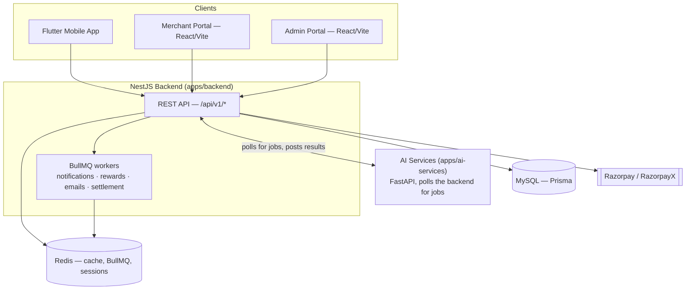

# Architecture

This describes the system as it actually exists in this codebase today — not the
aspirational platform sketched in `Review Hub.txt`. Where the two disagree, this
document wins; treat that file as historical product-vision notes, not a spec.

## System overview

VIRAL KAR is a NestJS + MySQL (Prisma) backend serving three clients — a Flutter
mobile app, a React merchant portal, and a React admin portal — plus a separate
Python/FastAPI service that does AI-assisted verification and content generation.

## Tech stack (as actually used)

| Layer | Choice | Notes |
|---|---|---|
| Backend | NestJS + TypeScript | Feature-module architecture, see below |
| Database | MySQL via Prisma | 88 models, UUID PKs, soft deletes throughout |
| Cache / sessions / rate-limit | Redis | Also backs BullMQ |
| Background jobs | **BullMQ** (Redis-backed) | Not RabbitMQ — see note below |
| File storage | Local disk (`apps/backend/uploads/`) | No S3/cloud storage anywhere, by design |
| Payments | Razorpay (checkout) + RazorpayX (payouts) | Test-mode credentials only so far |
| Frontend (both portals) | React, Vite, TypeScript, Tailwind, React Query, React Hook Form | Shared UI in `packages/shared-ui` |
| Mobile | Flutter, Riverpod, GoRouter, Dio | |
| AI | Python, FastAPI, local Ollama (optional), local OCR | No paid AI provider wired in |

**RabbitMQ is provisioned in `docker-compose.yml` and referenced in `.env`, but
nothing in `apps/backend/src` actually uses it** (no `amqplib`/`@nestjs/microservices`
import anywhere). Every background job — email, notification dispatch, reward
crediting, nightly settlement — runs through BullMQ queues instead, which are
Redis-backed. Treat RabbitMQ as inactive infrastructure until something is
actually wired to it; don't assume message-queue behavior depends on it.

## Backend module map

15 feature modules under `apps/backend/src/modules/`, each following the same
internal shape (controllers → services → repositories → Prisma):

| Module | Owns |
|---|---|
| `auth` | Registration, login (password + Google/Apple OAuth), OTP, JWT access/refresh, RBAC, device tracking + basic fraud-risk signals, sessions, login history |
| `merchant` | Merchant profiles, KYC documents, bank accounts, team members, merchant wallet (recharge via Razorpay), **refund requests** (cash-out to bank via RazorpayX) |
| `campaign` | Campaign CRUD, admin approval workflow, budget reserve/release against the merchant wallet |
| `task` | Campaign tasks, user task participation, submission review |
| `wallet` | User wallet, rewards, withdrawal requests (RazorpayX payout), bank accounts |
| `payment` | Razorpay/RazorpayX SDK wrapper, webhook signature verification and event parsing |
| `ai` | Bridges to `apps/ai-services`: exposes an internal job-queue API the Python worker polls, plus review/caption-draft passthrough endpoints |
| `admin` | Cross-cutting admin surface: user management, fraud flags (submission-level + device-risk), campaign/withdrawal/refund approval queues, CMS, feature flags, audit log viewer, settings |
| `notification` | In-app notifications, push (FCM), preferences, BullMQ dispatch queue |
| `support` | Support tickets (user + merchant), messages |
| `settlement` | Nightly merchant settlement runs, GST-inclusive invoice generation (PDF) |
| `gamification` | Badges, daily-reward prizes/claims, gamification profile |
| `marketplace` | Redeemable marketplace items, redemptions |
| `referral` | Referral tracking and reward crediting |
| `user-kyc` | User-side KYC (PAN) document upload/verification — gates withdrawals |

Cross-cutting infra lives outside `modules/`: `common/` (response envelope,
exception hierarchy, guards, pipes), `shared/` (audit log, health, logger),
`queues/`, `storage/`, `mail/`, `sms/`, `database/` (Prisma service).

## Key patterns actually in force

- **Every API response** goes through a global response interceptor — never a
  raw Prisma object, never a bare array. Errors go through a global exception
  filter built on an `AppException` hierarchy (`common/exceptions/`), never a
  generic `Error`.
- **Money-movement modules (wallet, merchant wallet, refunds) all follow the
  same hold → finalize/release pattern**: an amount is moved out of
  `availableBalance` into a dedicated holding field the instant a
  withdrawal/refund is *requested*, then either cleared (approved → payout) or
  returned (rejected) — never adjusted directly on approval. Every state change
  writes an immutable `WalletTransaction` ledger row. See
  `modules/wallet/services/withdrawal.service.ts` and
  `modules/merchant/services/refund.service.ts` for the two implementations of
  this same shape.
- **RazorpayX payouts are fire-and-forget with webhook reconciliation.**
  Approving a withdrawal/refund finalizes the ledger immediately and *attempts*
  a payout; a dedicated listener (`PayoutListener` /
  `MerchantRefundPayoutListener`) reacts to Razorpay's webhook later to mark it
  PAID or reverse the ledger if it actually failed. The two listeners share one
  webhook event stream and silently ignore reference IDs that aren't theirs.
- **Cross-module side effects go through `EventEmitter2`**, not direct service
  calls (20 files emit or listen for domain events — `campaign.status_changed`,
  `wallet.withdrawal.requested`, `merchant.refund.approved`, etc.). If you're
  adding a side effect to an existing flow (e.g. "also notify the user when X
  happens"), check for an existing event before wiring a direct dependency.
- **AI verification is a pull model, not a push one.** The Python service in
  `apps/ai-services` polls `GET /api/v1/internal/ai/verification-jobs/next` on
  a timer, downloads evidence, verifies it, and posts the result back — the
  NestJS backend never calls into Python directly. This means the backend
  works (with submissions parked as pending) even if the AI service is down.
- **Business-verification and identity-verification gates are enforced at the
  service layer**, not just the UI: merchants must have
  `verificationStatus === 'APPROVED'` before requesting a refund; users must
  have a verified PAN before requesting a withdrawal.

## Known gaps (accurate as of this writing)

- Razorpay credentials are test-mode only (`rzp_test_...`); no live-money path
  has been exercised.
- `RAZORPAY_X_ACCOUNT_NUMBER` is still the literal placeholder from
  `.env.example` — RazorpayX payouts will fail validation until a real virtual
  account number is configured.
- Device-risk fraud signals (root/emulator self-report + a header-based VPN
  heuristic) are captured and visible to admins but don't block anything yet —
  see `modules/auth/services/device.service.ts`.
- No refund/GST engine exists for anything except the merchant wallet cash-out
  flow described above (e.g. no automated campaign-budget refund on merchant
  request, no credit-note engine).

## Where to look next

- Live, always-accurate endpoint list: [`../api/README.md`](../api/README.md)
  (Swagger UI at `/api/docs` when the backend is running).
- Coding conventions, response format, logging rules, module-structure
  requirements: [`/CLAUDE.md`](../../CLAUDE.md) at the repo root.
- Backend-specific setup notes: `apps/backend/README.md`.
